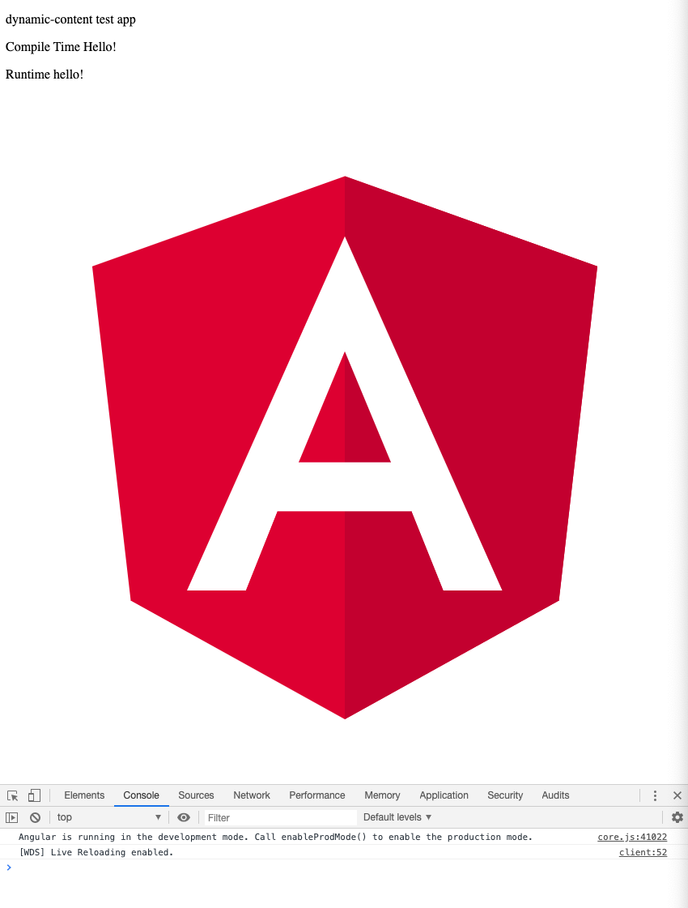
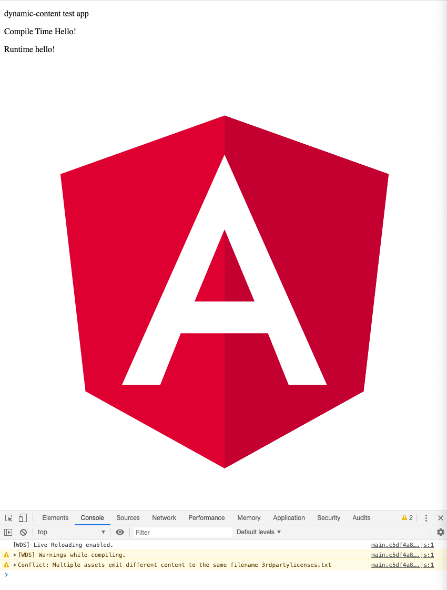
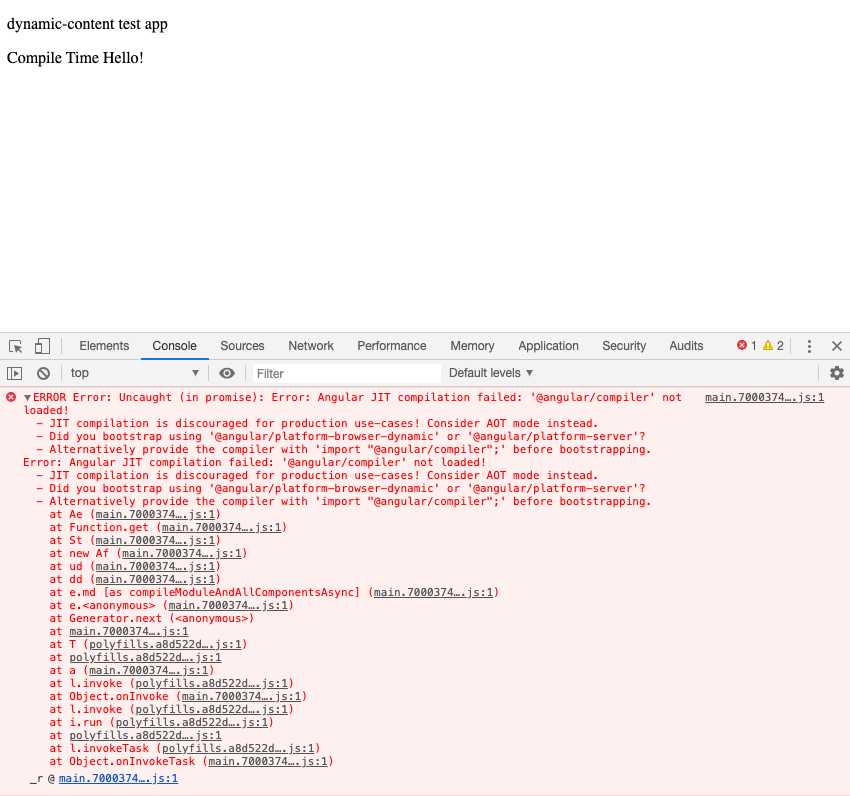

### Angular dynamic content issue
This repo contains a minimal Angular project that demonstrates how code that works in development and a production build is broken by the build optimizer.

It replicates an issue we faced where a new Angular application was interfacing with a legacy application that had saved content in a database. This could not be known at compile-time, so this was loaded via dynamic components/modules.

**Working**

`ng serve`

`ng serve --configuration=production`


** Broken **

`ng serve --configuration=production-build-optimized`


Where the only difference between `production` and `production-build-optimized` is the `"buildOptimizer"` value in `angular.json`.

The error produced in the console is
```
main.7000374ef126bad8069c.js:1 ERROR Error: Uncaught (in promise): Error: Angular JIT compilation failed: '@angular/compiler' not loaded!
  - JIT compilation is discouraged for production use-cases! Consider AOT mode instead.
  - Did you bootstrap using '@angular/platform-browser-dynamic' or '@angular/platform-server'?
  - Alternatively provide the compiler with 'import "@angular/compiler";' before bootstrapping.
Error: Angular JIT compilation failed: '@angular/compiler' not loaded!
  - JIT compilation is discouraged for production use-cases! Consider AOT mode instead.
  - Did you bootstrap using '@angular/platform-browser-dynamic' or '@angular/platform-server'?
  - Alternatively provide the compiler with 'import "@angular/compiler";' before bootstrapping.
    at Ae (main.7000374ef126bad8069c.js:1)
    at Function.get (main.7000374ef126bad8069c.js:1)
    at St (main.7000374ef126bad8069c.js:1)
    at new Af (main.7000374ef126bad8069c.js:1)
    at ud (main.7000374ef126bad8069c.js:1)
    at dd (main.7000374ef126bad8069c.js:1)
    at e.md [as compileModuleAndAllComponentsAsync] (main.7000374ef126bad8069c.js:1)
    at e.<anonymous> (main.7000374ef126bad8069c.js:1)
    at Generator.next (<anonymous>)
    at main.7000374ef126bad8069c.js:1
    at T (polyfills.a8d522dff2c1a5c4b9db.js:1)
    at polyfills.a8d522dff2c1a5c4b9db.js:1
    at a (main.7000374ef126bad8069c.js:1)
    at l.invoke (polyfills.a8d522dff2c1a5c4b9db.js:1)
    at Object.onInvoke (main.7000374ef126bad8069c.js:1)
    at l.invoke (polyfills.a8d522dff2c1a5c4b9db.js:1)
    at i.run (polyfills.a8d522dff2c1a5c4b9db.js:1)
    at polyfills.a8d522dff2c1a5c4b9db.js:1
    at l.invokeTask (polyfills.a8d522dff2c1a5c4b9db.js:1)
    at Object.onInvokeTask (main.7000374ef126bad8069c.js:1)
```